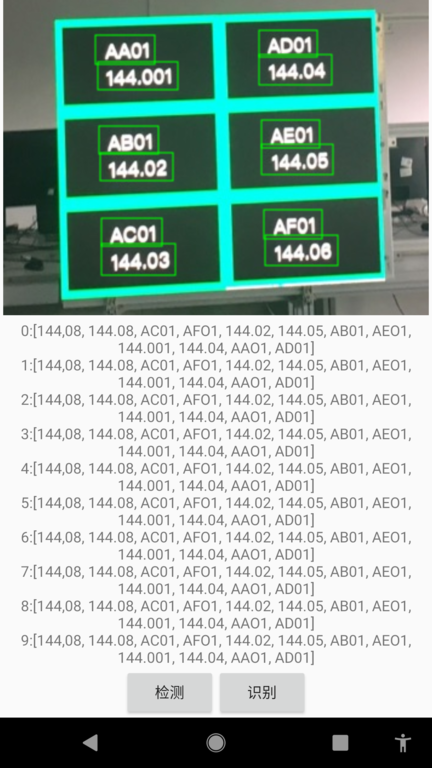
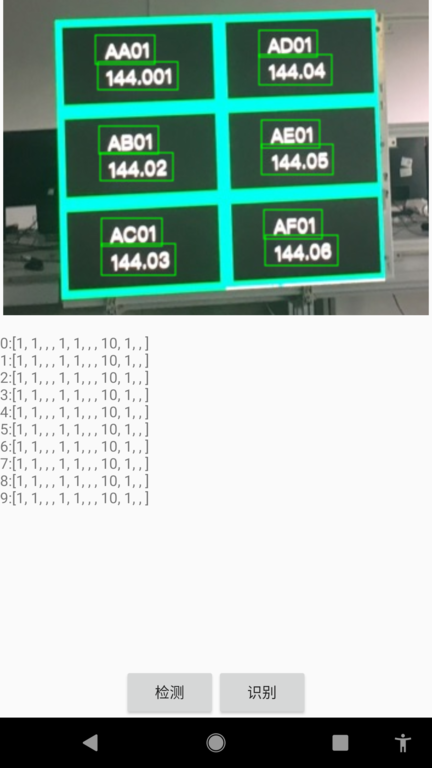
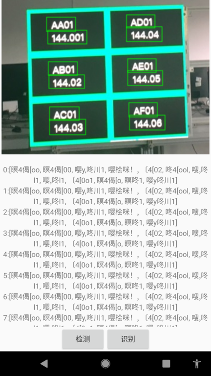

# MNN Android环境 OCR模型移植

OCR预训练模型来自MNN工作台提供的ocr demo

## 操作步骤

Demo操作如下：

- 1、界面中有检测和识别按钮，点击检测按钮会检测出图片中的文本区域，裁剪为图片并缓存起来
- 2、点击识别按钮识别缓存的图片文本
- 3、重复点击识别按钮，观察相同输入下，结果却并不是每一次都相同
  
    未出现异常请多次点击识别按钮
 
 正常情况下:
 
 
 
 异常之一:
 
 
 
 
 
 ## 主要问题：
 
 问题1:
 
 测试每一次识别时都重新创建推理引擎，相同的输入的情况下输出结果会出现不同,使用64位MNN动态库结果不一致更多
 
 问题2:
 
 如果每一次都让resizeSession 多次输入结果也会不一致,甚至出现崩溃
 
 日志如:signal 11 (SIGSEGV), code 1 (SEGV_MAPERR), fault addr 0xbf5dbf70
      